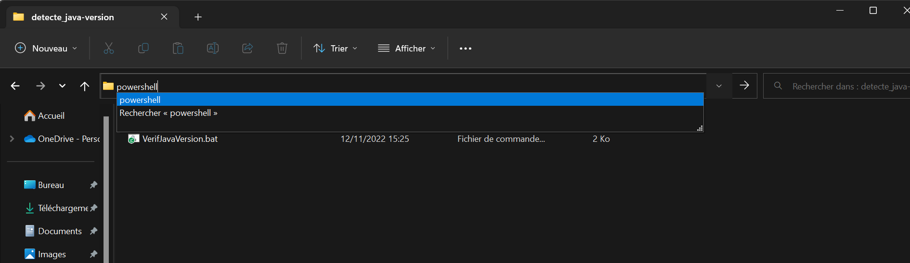

# Script permettant de détecter la version de java
Permet de savoir si **Java** est installée sur l'ordinateur sur lequel ce script est lancé.
Si Java est installée, mais n'a pas la bonne version le script affiche une boite de dialogue permettant de télécharger automatiquement Java jdk 16.


## Lancement du scrip
Pour lancer le script, il existe deux solutions, la première via l'interface Windows et la deuxième via un terminal. Il n'y a aucune réelle différence entre les deux méthodes si ce n'est que c'est plus rapide de passer par l'interface Windows.

### Interface windows
Après l'avoir téléchargé double-cliquer sur le script.

### Terminal windows
Après l'avoir téléchargé dans le répertoire où se trouve le script écrivez dans la barre en haut **cmd** ou **powershell**. Dans le terminal, écrivez `./VerifJavaVersion.bat`

Illustration pour ouvrir un cmd ou un powershell



## Modification du script
### Changer les versions valides
Si vous voulez changer les versions de java valide, il vous faut remplacer les nombres `"16 17 18 19"` à la ligne 11 par les versions de java valide dans votre cas d'utilisation.

Extrait de la ligne 11 :
```bat
FOR /F "usebackq delims=" %%A IN (`java -version 2^>^&1`) DO echo %%A | findstr /i "16 17 18 19" && (
```


### Changer le lien de téléchargement
Si vous voulez changer la version de Java installée en cas d'absence de Java ou de version de Java non-valide, il faut changer le lien après `start` à la ligne 33.

Extrait de la ligne 33 :
```bat
start https://www.techspot.com/downloads/downloadnow/7407/?evp=bb667956a140a1a0a56260d7df5d40bf^&file=9975
```

**Attention**[color=#26B260] même dans une URL les caractères spéciaux doivent échapper avec le caractère d'échappement approprié !
